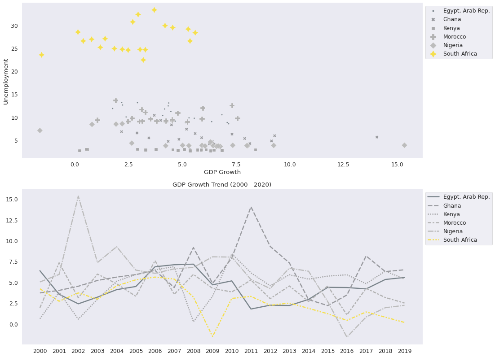

# Unemployment in South Africa
### Exploratory Data Analysis & Data Vizualisation

Unemployment in South Africa has reached crisis levels and current projections show no signs of improvement.  The South African Government cites [6 possible root causes](https://www.gcis.gov.za/content/resourcecentre/newsletters/insight/issue13) for the high unemployment. This notebook sets out to determines if there is data to support these theories.   

### Data Sources
In this EDA and Data Visualisation, I sourced 2 datasets from the World Bank Group (WBG) to test and evaluate each of these theories. 

**ESG Dataset**
The Sovereign Environmental, Social and Governance (ESG) dataset contains 17 key sustainable measurements spanning three categories namely Environmental, Social and Governance. The World Bank Group (WBG) provides this information to investors help channel financial flows to more sustainable activities that are better aligned with the United Nation's Sustainable Development Goals. 

Source: [World Bank Group(WBG) Sovereign Environmental, Social and Governance Data](https://datatopics.worldbank.org/esg/) 

**Gross Domestic Product Dataset**
Gross Domestic Product (GDP) is a common way to measure the size of a country's economy. GDP is the value of all final goods and services produced within a country in a given year. GDP figures in this dataset are in current U.S. dollars and spans data from 1990 to 2019.

Source: [World Bank Group(WBG) DataBank World Development Indicators GDP(Current US$)](https://databank.worldbank.org/reports.aspx?source=2&series=NY.GDP.MKTP.CD&country=#)

## Exploratory Data Analysis
After importing the ESG and GDP datasets, I created a subset of the data for all African countries.  These datasets were then grouped by region according to the United Nations classification of African countries. 

I then identified indicators from the ESG dataset that could be used to analyse each of the root causes.  Below is a table depicting the selected indicator(s).

## Unemployment Comparison
During the first round of analysis and visualisation I compared South African unemployment to rates in the various regions as well as unemployment compared to other Southern African countries. 

Both of these graphs shows South Africa to have some of the highest unemployment rates compared to it's African neighbours. 

## Find the Top Ten Economies
Diving in a bit deeper, I decided to segment the data more and identify those African countries that have a closer resemblance to South Africa.  Since South Africa has one of the largest economies in Africa, I used GDP size to isolate the largest ten economies on the continent.

**Insights:**

> These economies vary quite a bit with **Nigeria's GDP** almost **eight times** the size of the smallest, **Tanzania**.

> Despite the variance, we will keep on comparing **associated features** to look at more similarities and/or variances.

## Unemployment in The Top Ten
Below is a comparison of unemployment in the top ten economies in Africa:

**Insights**

> Compared to the top ten economies in Africa and measured across 20 years, South Africa still stands out with much higher unemployment levels compared to the other 9 countries.

> The only similar data for unemployment is in Algeria, between 2000 to 2003

**Next Questions**

> Can South African unemployment be compared to these other African economies? 

> Are these economies similar and/or comparable to South Africa's economy ?

## Associated Factors
To answer the questions above, we will look at the 6 reasons provided by the South African Government to explain unemployment levels based on the indicators chosen from the ESG dataset. We will investigate each of these as factors and compare those across the top ten economies. 

## Pearson Correlation between the Associated Factors

Since the data consists of continuous numeric variables, we can perform a **Pearson Correlation Coefficient** test on the values to determine which of these factors, according to the data, has the highest correlation to unemployment. 

It is important to remember at this point that correlation does not necessarily imply causation.  

**Insights**
> The highest correlation can be found between **unemployment** and **GDP growth** at -0.77. The negative relationship confirms that low GDP growth will cause high unemployment.  

> The second- and third highest correlations exist between **access to internet** and **literacy rate** and **unemployment**.  

## Compare the Associated Factors across Top Ten Economies

**Insights**

> Looking at **labour force participation** as a percentage of the total population, South Africa compares well with Nigeria and Morocco, while Algeria and Egypt has higher numbers while Ethiopia and Tanzania has the highest participation rates on the continent. 

> The ratio of **females partaking** in the job market in South africa is very similar to the rates in Ethiopia and Nigeria.

> South Africa's **literacy rate** scores far above the rest of the economies, with Ethiopia coming in last in this section. 

> The **GINI index** clearly illustrate the unequal nature of South Africa's economy, or as some refer to it, the **two-speed economy**.  A number of the other factors, like literacy, need to be interpreted side by side with this index. 

> **GDP growth** probably displays the most disheartening of numbers since ultimately, an economy needs to grow for jobs to be created, and South Africa's economy has not been growing nearly as fast as we need it to grow. The global economical crisis of 2008/9 as well as the rise of then President Jacob Zuma and state capture has stunted growth of the South African economy. Compared, however to the other top ten countries in Africa, South Africa does not look that bad. Except for Ethiopia, who has shown above average growth in the group, the rest of the economies seem to be growing at more or less the same rate as SA's. 

> Evaluating the **Ease of Doing Business** indicator, it is clear that this needs urgent attemtion with 7 of the top economies trumping SA. 

> The onset of the 4th Industrial Revolution means that **Internet Access** for all is absolutely crucial first step.  This revolution, which is described as a fusion between our physical, digital, and biological worlds provides a unique opportunity for developing countries with the right infrastructure and skillsets to leapfrog past many developed economies. This is probably 'low hanging fruit' for South Africa, currently coming in only third in these economies in 2019.

> South Africa's **poverty headcount**, measured against a number of the other factors mentioned here, demonstrates the persistance of structural inequalities that haunts our nation.  There is no doubt that this is shameful and needs to be addressed as an absolute priority. 

## Comparable Countries

Based on the comparison of the factors associated with and contributing to unemployment in the top ten economies in Africa, I have narrowed the list down to 5 countries of which 3 are in Sub-Saharan Africa and 2 in Northern Africa.

Sub-Shahran African countries comparing best to South Africa are **Ghana, Kenya, Nigeria**.

Northern African countries comparing to South Africa based on the associated factors are **Egypt and Morocco**.

## Unemployment in Comparable Countries

### Legacy of Apartheid & Poor Education
Although the legacy of apartheid is unique to South Africa, we can compare poor education by looking at the Literacy Rate.

**Insights**

> From the kde plot a high literacy rate does not seem to be imperative to acceptable levels of employment.

### Labour demand and supply mismatch

**Insights**

> Combining the data from the 5 most comparable economies in Africa, greater labour participation (both male and female) does not automatically lead to higher unemployment. 

### The effects of the 2008/2009 global recession

**Insights**

> Looking at unemployment trend over the last 20 years, it is clear that South Africa was adversely affected during the 2008/9 global recession. 

> The Arab Rep of Egypt shows a similar decline following the 2008/9 recession, although they were able to curb and reverse the trend from 2013 onward to where they are back to approx. similar levels of unemployment to 2003. 

### Role of Trade Union Federations

**Insights**

> If the argument that South Africa's Trade Union Federations were really making life better for workers in South Africa, that evidence would show up in the Poverty Headcount. The data shows that to not be true. 

### General lack of interest in Entrepreneurship 
According to government, there is a general lack of interest in Entrepreneurship in South Africa. 
We will compare two indicators, Ease of Doing Business and Access to the Internet and see what the relationship is between these factors and unemployment in the 5 comparable countries. 

#### Ease of Doing Business

**Insights**

> Comparing the 5 most similar countries to SA, 3 make it easier to do business in their country than SA.  This could very well be contributing to the shortage of initiative and entrepreneurship.

> In countries where the entry barriers to starting a business is lower, the comparative unemployment levels are lower. 

#### Access to the Internet

**Insights:**

> Access to the Internet does not seem to be a big factor that contributes to unemployment. 

> Although access to the Internet alone does not reduce unemployment, it does widen up  opportunities for entrepreneurship. SA has the second highest accessability to the internet.  

### Slow economic growth
GDP growth showed the highest correlation to unemployment across the top ten economies. Now, let's compare GDP growth in the 5 most similar economies. 

**Insights**

> South Africa's GDP growth was hampered by the 2008/9 global recession and despite having bounced back in 2010, it has been on a steady decline since then. 

> Looking at the scatterplot though, South Africa's GDP growth is not completely out of bounds when compared to the similar economies and as was seen previously, the comparable economies does not display such high numbers of unemployment.  

## Conclusion
In order to solve a problem, one needs, among other things, a good understanding of the root causes of a problem. The results displayed in this analysis does not seem to support the official reasons given for unemployment.  

What became clear from this analysis, though, is that South Africa is not as different from its African neighbours as might sometimes be believed. 

Africa is a unique continent and we might find it usefull to look at our neighbours for successful and best practices that lead to improved employment and a better life for all.

[RETURN TO PORTFOLIO](https://africanleo.github.io/Leonora-Schreurs-Portfolio/)
